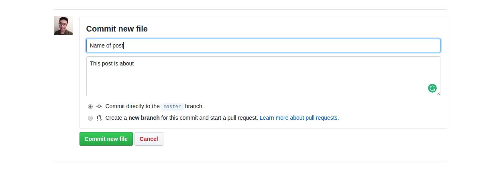

#  Instruction for uploading Blog post.

### 1. Go the folder called posts

### 2. Create a new file using the format YYYY-MM-DD-title.md in the title bar

For Example:
>"2017-04-25-Building_A_Solar_Panel.md"

   
### 3. When you start a create a new file the following text must go first in the md file.
---

layout: post

title: "Building a Solar Panel"

date: 2017-04-30

---

### 4. Enter the information about the blog post in markdown syntax

### 5. Once you are down scroll down and enter some description about the type of post you made. Then press commit.

##Use images
To use images, navigate to the image folder. In there image folder should be another folder called blogpost. Go in there. Find your name of your folder. Upload an images you want into there.
Reference the images in your blogpost md file using the syntax ''. (file.png is whatever file type you uploaded)
